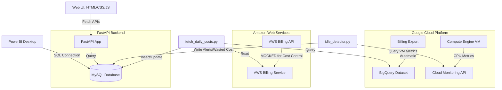

# FinOps Dashboard - Architecture Design

This document details the system design, data flow, and architectural components of the multi-cloud FinOps Dashboard.

## Architecture Diagram

## Architectural Components

1. **Billing Ingestion**:
   - **GCP**: Billing Export is configured to push cost details automatically to a BigQuery dataset. A script queries this dataset daily.
   - **AWS**: Due to AWS Cost Explorer API costs ($0.01 per call), AWS cost retrieval is mocked at the service layer using a synthetic data generator. The interface and response payload match AWS Cost Explorer's output structure exactly, allowing for easy migration to the real API if budget permits.

2. **Idle Resource Detection**:
   - The backend runs a routine checking GCE VM instances. It queries the **Cloud Monitoring API** for `compute.googleapis.com/instance/cpu/utilization` over a lookback window (e.g., 7 or 14 days).
   - If average utilization is below 5%, the instance is flagged as idle.
   - Potential cost savings are calculated based on the instance's machine type and cost per hour.

3. **Storage**:
   - A MySQL database stores aggregated daily costs per service/provider and active idle alerts.

4. **APIs**:
   - FastAPI serves endpoints for cost trends (by provider, service, date range) and optimization recommendations.
